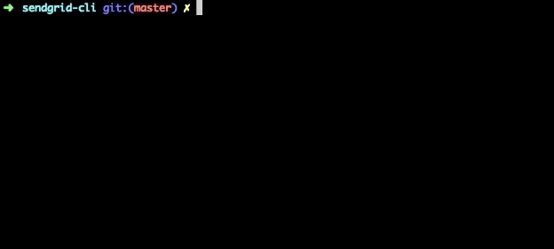

# SendGrid CLI

The SendGrid CLI (Command Line Interface) is a tool that helps you to interact with SendGrid services from the command line.  It is helpful for automating routine tasks.  The SendGrid CLI removes the need to write code to perform common management activites of the SendGrid platform like uploading a CSV file and enabling/disabling webhooks.

# Prerequisites

* SendGrid Account
* Tested with NodeJS v8.12.0

# Installation

* Clone this project
* `cd sendgrid-cli`
* `npm install`
* Rename `.env_sample` to `.env` and update the values

## A Note on API Key and API Token

In the `.env_sample`, you will notice two environment variables, `SENDGRID_API_KEY` and `SENDGRID_TOKEN`.  For certain commands, you will need to use `SENDGRID_TOKEN`.  To learn how to retrieve this token [here](RETRIEVE_TOKEN.md).

# Usage

This command line interface implements a limited set of commands.

* `./sg list-apikeys`: List API keys
* `./sg subuser-admins`: Iterate over all subusers and list all teammates (including role) for each subuser (requires `SENDGRID_TOKEN` see note above)
* `./sg contacts upload`: Upload contacts from a CSV file (fields: email, first_name, last_name)
* `./sg webhooks`: Manage Event and Inbound Parse webhooks

These will output JavaScript Objects that are human readable.

You can also prepend `DEBUG=sg:*` for additional debug logging (not much yet).

Debug namespaces:
* `sg:client`
* `sg:utils`
* `sg:contacts-upload`
* `sg:subuser-admins`
* `sg:webhooks-add-parse`
* `sg:webhooks-disable-event`
* `sg:webhooks-enable-event`

# Todos

* Pipe from one command into another (need to output JSON strings to stdout)

# License

[LICENSE](LICENSE)